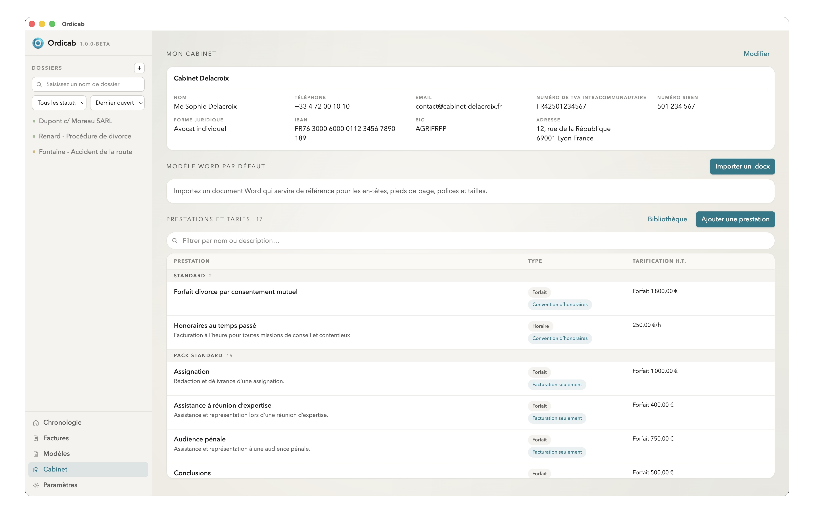
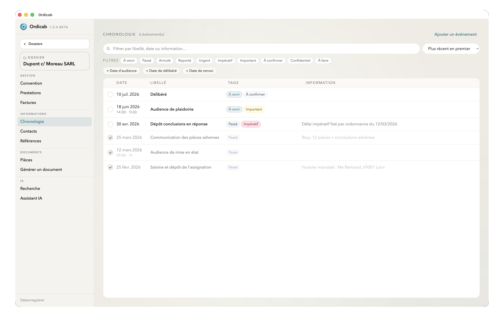
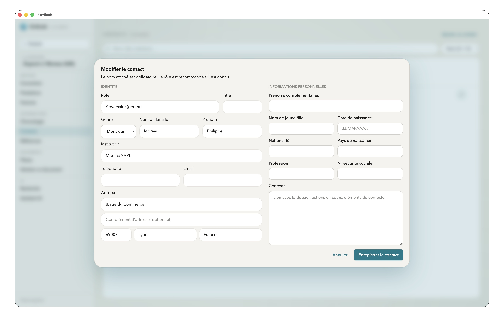
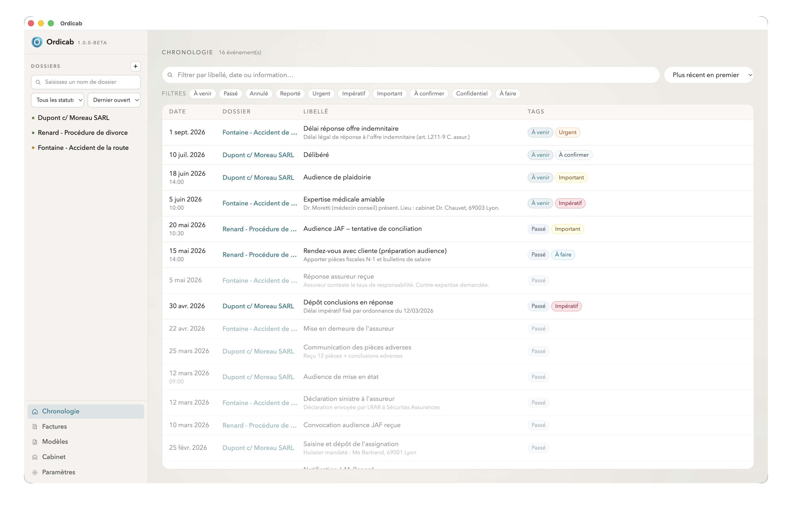
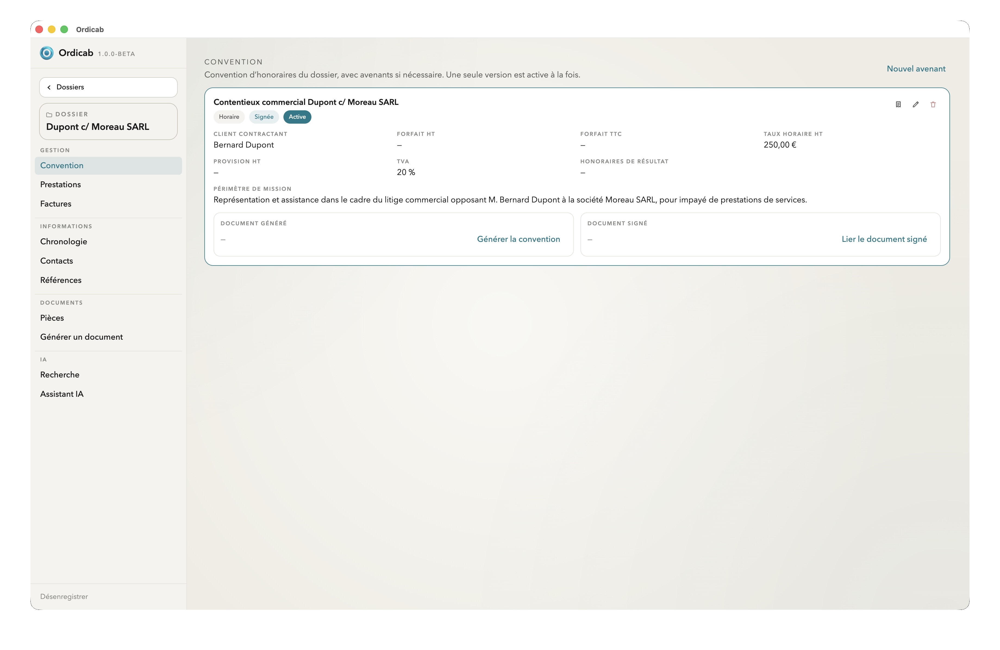
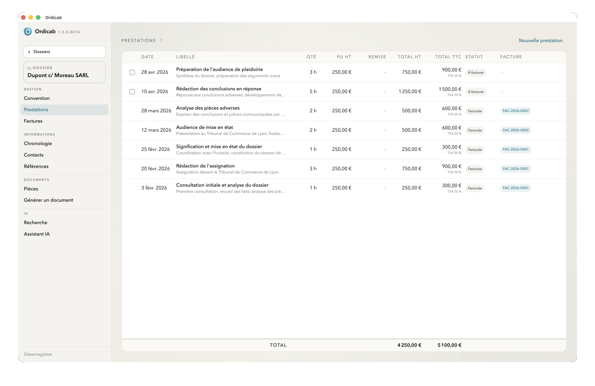
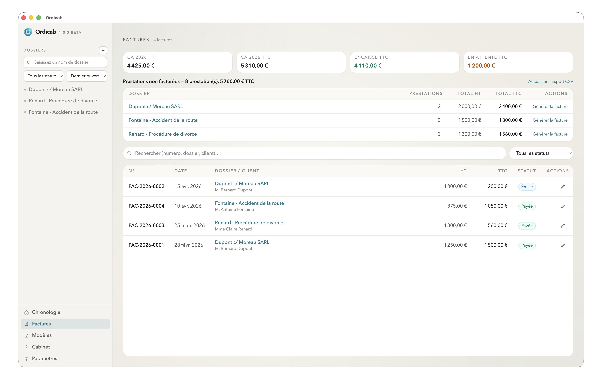
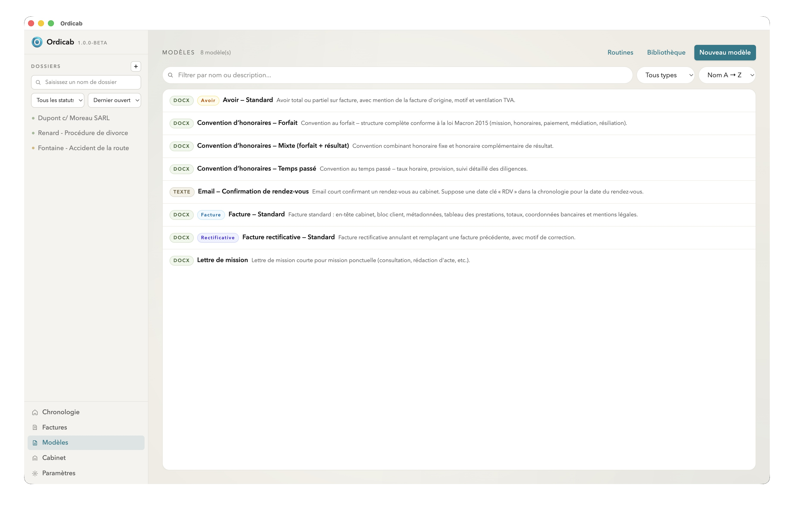
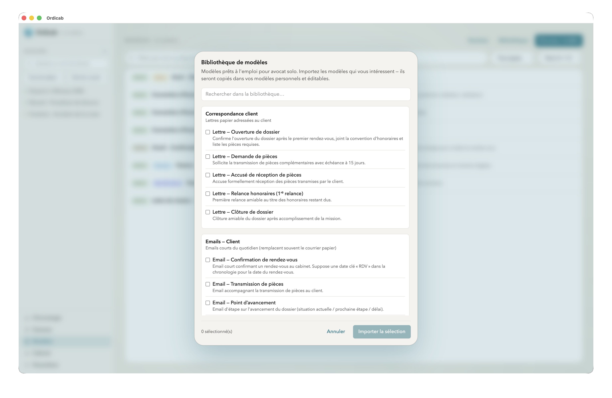
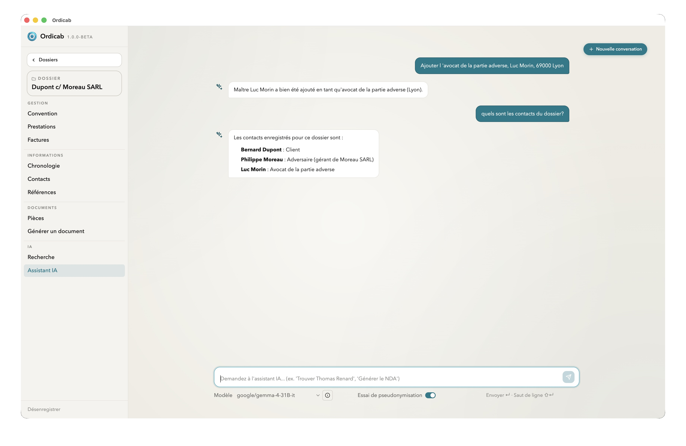

# Ordicab

Ordicab est une application de bureau destinée aux avocats solo et aux petites structures souhaitant gérer efficacement leurs dossiers : informations clés, contacts, documents, modèles, conventions d'honoraires, prestations, factures et travaux assistés par l'IA.

Site web : [www.ordicab.com](http://www.ordicab.com)

## Une application pensée pour les avocats solo

Ordicab repose sur une architecture de données centrée sur le cabinet, les dossiers et leurs éléments métier. Les contacts, pièces, références, échéances, conventions, prestations, factures et modèles ne sont pas des fichiers isolés : ils sont structurellement liés aux dossiers et peuvent être exploités aussi bien par l'application que par les fonctions d'IA.

Cette organisation garantit une base de travail claire, portable et pérenne, tout en maintenant les données sous le contrôle du cabinet. Elle est compatible avec une organisation par dossiers synchronisés sur un service de stockage cloud. Pour des raisons réglementaires et de souveraineté des données, une solution telle que **kDrive d'Infomaniak** est recommandée.

## Fonctionnalités

- **Gestion des dossiers** : suivi des informations principales, type de dossier, statut, références, échéances et notes.
- **Contacts de dossier** : clients, adversaires, juridictions, confrères, tiers et autres intervenants, avec leurs coordonnées et leurs rôles.
- **Documents** : classement, consultation et prévisualisation des pièces liées au dossier.
- **Chronologie** : vision structurée des événements importants et des dates clés.
- **Conventions d'honoraires** : suivi des conventions, phases, forfaits, taux et modalités.
- **Prestations** : saisie et suivi du travail réalisé, avec lien vers la facturation.
- **Factures** : préparation et suivi des éléments facturables.
- **Modèles de documents** : bibliothèque de modèles et génération de documents à partir des données du dossier.
- **Gestion du cabinet** : informations de la structure, paramètres métier et données réutilisables.

## Aperçu de l'application

### Piloter le cabinet

La vue cabinet centralise les informations de la structure, les paramètres et les données réutilisables.

### Suivre un dossier

| Vue d'ensemble | Contacts |
| --- | --- |
|  |  |

| Chronologie | Convention d'honoraires |
| --- | --- |
|  |  |

Chaque dossier regroupe les informations importantes, les intervenants, les échéances, les références et les éléments contractuels.

### Produire, facturer et suivre le travail

| Prestations | Factures |
| --- | --- |
|  |  |

| Modèles | Bibliothèque |
| --- | --- |
|  |  |

Ordicab relie les prestations, la facturation et les modèles afin de réduire les saisies redondantes et d'accélérer la production des documents récurrents.

### Travailler avec l'IA

L'assistant IA exploite le contexte du dossier pour retrouver, résumer, rédiger ou structurer les informations.

## Fonctionnalités IA

L'IA d'Ordicab est intégrée au travail réel du dossier. Elle s'appuie sur les contacts, les documents, les modèles et les informations structurées pour intervenir sur des tâches concrètes :

- retrouver une information dans un dossier ;
- résumer des documents ou un ensemble de pièces ;
- préparer un courrier, un projet d'e-mail ou une note interne ;
- extraire des contacts, dates, références ou éléments significatifs ;
- exploiter les modèles de documents avec le contexte du dossier ;
- accompagner l'organisation d'un dossier complexe ;
- effectuer des recherches sémantiques, au-delà des mots-clés.

Ordicab est compatible avec plusieurs approches d'IA selon les contraintes du cabinet : assistant local, API distante, agent externe ou export dédié vers un modèle avancé.

## Pseudonymisation bidirectionnelle

La pseudonymisation bidirectionnelle est une fonctionnalité centrale d'Ordicab.

Avant d'utiliser certains services d'IA externes, Ordicab peut substituer les informations sensibles par des pseudonymes stables. L'IA traite ainsi un dossier intelligible sans accéder aux noms, coordonnées ou identifiants réels. Une fois le traitement terminé, Ordicab peut réintégrer le résultat et rétablir les données d'origine.

Ce mécanisme est bidirectionnel :

- **à l'aller** : les données sensibles sont remplacées par des pseudonymes ;
- **au retour** : les productions utiles sont décodées et réinsérées dans le bon contexte.

L'objectif est de rendre l'IA exploitable dans le quotidien d'un cabinet sans compromis sur les exigences de confidentialité.

## Architecture IA

Ordicab intègre plusieurs modes de traitement :

- **IA locale** : utilisation de modèles locaux, par exemple via Ollama, pour maintenir le traitement sur la machine.
- **Modèles embarqués** : certains traitements, tels que la reconnaissance d'entités et les recherches sémantiques, fonctionnent localement.
- **API distantes** : connexion à des modèles externes pour bénéficier de capacités avancées.
- **Agents externes** : Ordicab peut préparer un environnement de travail pour des assistants tels que Claude Code, Codex ou Copilot, tout en conservant le contrôle des modifications.
- **Export pseudonymisé** : préparation d'un dossier pseudonymisé pour traitement par un modèle avancé, puis réimport dans Ordicab.

L'IA peut proposer, extraire, rédiger ou organiser ; Ordicab conserve la validation, la structure et l'exécution des actions sur les données du cabinet.

## Description technique

Ordicab est une application desktop développée avec :

- **Electron** et **electron-vite** pour l'application de bureau ;
- **React**, **TypeScript** et **Tailwind CSS** pour l'interface ;
- **Zustand** pour l'état applicatif ;
- **Tiptap** pour l'édition de contenus enrichis ;
- **Zod** pour la validation des données ;
- des intégrations IA locales et distantes selon les usages.

## État du projet

Ordicab est fonctionnel, mais en cours d'évolution active. Les fonctionnalités, l'ergonomie et les traitements IA font l'objet d'itérations continues à partir des retours d'usage en conditions réelles.

Les retours d'expérience de professionnels du droit sont les bienvenus et contribuent directement à l'orientation du projet.
